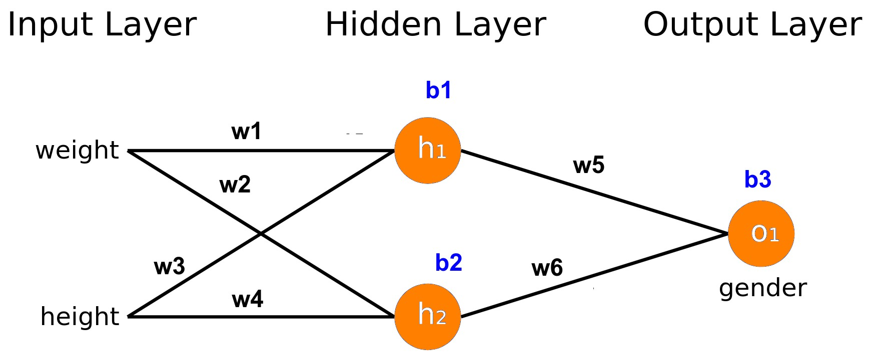

# Week 7 - Neural Network - Backpropagation
## Topics:
- Backpropagation Algorithm
- Loss Function and Optimization
- Vanishing Gradient Problem

## Activities:
- Implement Backpropagation in Neural Networks
- Train a simple Neural Network on a dataset

# Apa itu Neuron?
Jaringan syaraf tidak serumit itu! Istilah ”neural network” sering digunakan sebagai kata
kunci, tetapi pada kenyataannya, jaringan syaraf tiruan sering kali jauh lebih sederhana
daripada yang dibayangkan kebanyakan orang. Catatan kecil ini ditujukan untuk pemula
atau bahkan tidak memiliki pengetahuan dasar tentang pembelajaran mesin. Kita akan
memahami cara kerja neural network. 

# Membangun Neural Network

# Lecturer Notes
Cek file catatan di [sini](lecturer_notes.pdf)