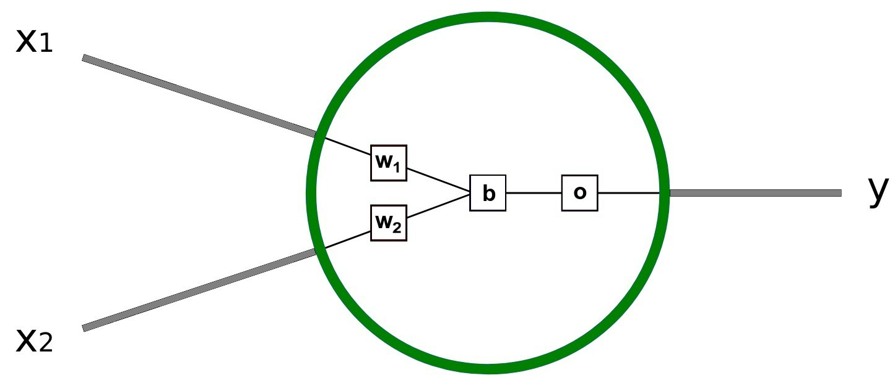

# Week 7 - Neural Network - Backpropagation
## Topics:
- Backpropagation Algorithm
- Loss Function and Optimization
- Vanishing Gradient Problem

## Activities:
- Implement Backpropagation in Neural Networks
- Train a simple Neural Network on a dataset

# Apa itu Neuron?
Jaringan syaraf tidak serumit itu! Istilah ”neural network” sering digunakan sebagai kata
kunci, tetapi pada kenyataannya, jaringan syaraf tiruan sering kali jauh lebih sederhana
daripada yang dibayangkan kebanyakan orang. Catatan kecil ini ditujukan untuk pemula
atau bahkan tidak memiliki pengetahuan dasar tentang pembelajaran mesin. Kita akan
memahami cara kerja neural network.

Pertama, kita harus berbicara tentang neuron, unit dasar dari jaringan saraf. Sebuah
neuron menerima input, melakukan beberapa perhitungan dengan input tersebut, dan
menghasilkan satu output. Gambar 1 merupakan bentuk neuron sederhana dengan 2
inputan.

Ada beberapa hal yang terjadi di sini:
1. Setiap inputan $x_1$ dan $x_2$ dikalikan dengan suatu bobot. Di sini, $x_1$ dikalikan
dengan bobot $w_1$ , sedangkan $x_2$ dikalikan dengan bobot $w_2$. Bobot sini adalah faktor pengali yang menentukan seberapa besar pengaruh setiap inputan terhadap
output. Apabila dituliskan dalam bentuk persamaan, hasilnya adalah:
$$
z_1 = x_1 \cdot w_1 
$$

$$
z_2 &= x_2 \cdot w_2 
$$